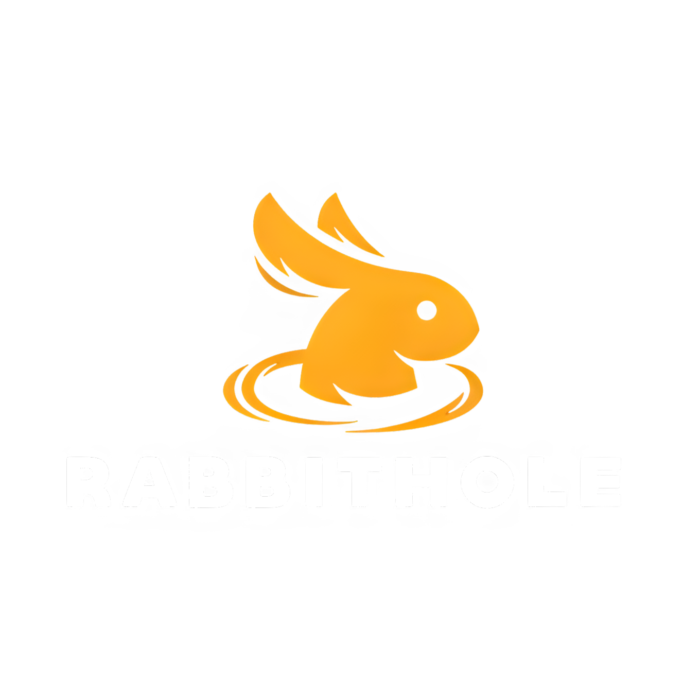

<div align="center">
  🚩🧡🕉️ || जय श्री राम || 🕉️🧡🚩
</div>

---

<div align="center">
  <h1 style="border-bottom: none;">
    🐇 RabbitHole 🕳️
  </h1>
  <p>Build, host, and orchestrate AI agents with ease.</p>
</div>

<p align="center" width="100%">
  
</p>

<!-- Badges -->
<p align="center">
  <a href="LICENSE"></a>
  <a href="https://github.com/VinsmokeSomya/RabbitHole/stargazers"></a>
  <a href="https://github.com/VinsmokeSomya/RabbitHole/issues"></a>
  
</p>

**RabbitHole** is a developer-first framework for building and orchestrating LLM-powered agents. It simplifies the complexity of agent-to-agent communication, allowing you to focus on building powerful, intelligent applications.

Inspired by giants like **LangChain**, our vision is to create a comprehensive, interoperable ecosystem where agents built on different platforms can communicate and collaborate seamlessly.

## 🤔 Why RabbitHole?

Building AI agents involves more than just writing prompts. You need to handle server setup, communication protocols, and task management. RabbitHole abstracts away this boilerplate, providing a robust foundation for your agent applications.

Use RabbitHole for:
*   **Standardized Communication**: Built on Google's A2A protocol, RabbitHole ensures your agents speak a common language, making them interoperable by design.
*   **Rapid Development**: Get an agent server running with minimal code. Our framework provides the structure, so you can focus on your agent's unique logic.
*   **Extensible by Design**: With a plug-in architecture, RabbitHole makes it easy to integrate agents from different providers. We currently support Google's ADK and OpenAI's Agent SDK, with more on the way.
*   **Integrated Tooling**: Comes with a built-in CLI and a Streamlit UI for easy testing and interaction with your agents right out of the box.

## 🚀 Getting Started

### Installation

Get started by installing RabbitHole directly from the source. We recommend using a virtual environment.

```bash
# 1. Clone the repo
git clone https://github.com/VinsmokeSomya/RabbitHole.git

cd RabbitHole

# 2. Create a virtual environment and activate it
# We recommend `uv`, but Python's venv works great too.
python -m venv .venv

source .venv/bin/activate  # On Windows: .venv\Scripts\activate

# 3. Install in editable mode with all dev dependencies
pip install -e ".[dev]"
```

### Run Your First Agent

Let's run the pre-built Google ADK agent.

**1. Set up your API Key:**
Navigate to `rabbithole/agent/adk/`, copy `.env.template` to `.env`, and add your Google API key.

```bash
cd rabbithole/agent/adk

cp .env.template .env
# Now, edit .env to add your key
```

**2. Launch the Agent Server:**
From the `rabbithole/agent/adk` directory, run:
```bash
python __main__.py
```
The agent is now live on `http://localhost:10000`.

**3. Talk to Your Agent (from a new terminal):**
Navigate to the CLI directory and start the client.
```bash
# In a new terminal, from the project root
cd ../../cli

python __main__.py --agent http://localhost:10000
```
You're now chatting with your first agent! For more detailed instructions, check out **[How to Run and Test](./docs/howto.md)**.

## 📚 Documentation

Dive deeper into the RabbitHole ecosystem with our comprehensive guides:

- **[User & Contributor Guide](./docs/documentation.md)**: For getting started, core concepts, and contributing.
- **[Software Architecture](./docs/architecture.md)**: A technical deep-dive into the system's design.
- **[Developer Guide](./DEV-README.md)**: Everything you need to know to contribute code.

## 🗺️ Project Vision & Roadmap

Our goal is to evolve RabbitHole into a leading framework for AI agent development, on par with industry standards like LangChain and LlamaIndex.

Our roadmap includes:
- [ ] **Expanded Agent Support**: Integrating more agent SDKs (e.g., from Anthropic, Cohere).
- [ ] **Tool and Function Calling**: Standardized interfaces for agents to use external tools.
- [ ] **Agent Orchestration**: Building complex, multi-agent workflows (similar to LangGraph).
- [ ] **Memory and State Management**: Providing built-in solutions for long-term agent memory.
- [ ] **Deployment Solutions**: Simplified deployment to cloud platforms.

## 🤝 Contributing

RabbitHole is an open-source project, and we welcome contributions from the community! Whether it's adding a new agent integration, improving documentation, or fixing a bug, your help is valued.

Please read our **[Developer Guide](./DEV-README.md)** to get started.

## 📝 License

This project is licensed under the [MIT License](./LICENSE).
