This document provides a high-level technical blueprint for the major features outlined in the project [Roadmap](./roadmap). It is intended to guide architectural decisions and spark technical discussions for future development.

---

## 1. Blueprint for Standardized Tool & Function Calling

**Associated Roadmap Phase:** 2
**Goal:** Enable agents to reliably use external tools.

### 1.1. Architectural Changes

-   **Extend A2A Types (`rabbithole/a2a/types.py`):**
    -   Introduce new Pydantic models for `Tool`, `ToolCall`, and `ToolResult`. These will be based on established conventions (like OpenAI's function calling schema) to ensure interoperability.
    -   The `Task` model will be updated to include an optional `tools: List[Tool]` field, allowing a client to specify which tools the agent is allowed to use.
    -   The `TaskUpdate` model will include a `tool_calls: List[ToolCall]` field for the agent to request tool execution.

-   **Update the Agent Interface:**
    -   The base `Agent` class will need a new abstract method, `execute_tool(call: ToolCall) -> ToolResult`.
    -   The framework's `TaskManager` will be modified to orchestrate a tool-use loop:
        1.  If the agent's response contains a `ToolCall`, the `TaskManager` will pause the LLM interaction.
        2.  It will invoke the `execute_tool` method on the agent.
        3.  The returned `ToolResult` will be sent back to the LLM to inform its final response.

-   **Create a `tools` Module (`rabbithole/tools/`):**
    -   A new directory will house pre-built, reusable tools (e.g., `web_search.py`, `database_reader.py`). This will allow users to easily import and attach common functionalities to their agents.

### 1.2. Example Workflow Diagram

---

## 2. Blueprint for Multi-Agent Orchestration

**Associated Roadmap Phase:** 3
**Goal:** Enable complex workflows involving multiple, specialized agents.

### 2.1. Architectural Additions

-   **New Component: The Conductor (`rabbithole/conductor/`):**
    -   A new, top-level package will be created. The `Conductor` will be responsible for managing a stateful workflow graph.
    -   It will expose an API similar to the current A2A server but for managing higher-level "jobs" instead of single-agent "tasks."

-   **Define Workflow Graphs:**
    -   A workflow will be defined as a directed graph where each node is an "Agent" and edges define the path of data.
    -   We will create a simple Python API to define these graphs, e.g., `graph.add_node("research_agent")`, `graph.add_edge("research_agent", "writer_agent")`.

-   **The Supervisor Pattern:**
    -   A special type of agent, the `Supervisor`, will be implemented. Its role is to decide which agent (or tool) to route a request to next based on the current state. This allows for dynamic, intelligent routing within a workflow.

### 2.2. High-Level Diagram

```mermaid
graph TD
    subgraph User
        U[👤 User]
    end

    subgraph RabbitHole Conductor
        S[💡 Supervisor Agent]
        A1[🤖 Research Agent]
        A2[✍️ Writer Agent]
        T1[🛠️ Web Search Tool]

        S -->|1. Route to| A1
        A1 -->|2. Use Tool| T1
        T1 -->|3. Return Data| A1
        A1 -->|4. Send research| S
        S -->|5. Route to| A2
        A2 -->|6. Send final draft| S
    end

    U -- "Write a report on AI" --> S
    S -- "Final Report" --> U
```

This blueprint establishes a clear technical direction for achieving the project's ambitious goals. 