To effectively use RabbitHole, it's helpful to understand its core components.

## Core Components

- **A2A Server (`rabbithole/a2a/server`)**
  This is the heart of the framework. It's a web server (using FastAPI) that listens for incoming tasks, manages their execution, and sends back results. It handles all the complexities of the A2A protocol.

- **Agent (`rabbithole/agent/*`)**
  This is where you implement your specific logic. An "Agent" in RabbitHole is a Python module that defines how to handle a task. RabbitHole provides examples for Google's ADK and OpenAI's SDK, which you can use as templates for your own.

- **CLI Client (`rabbithole/cli`)**
  A command-line tool for sending tasks to a running A2A server. It's the primary way to interact with and debug your agents during development.

## High-Level Workflow
Here is a diagram visualizing how the components interact when a user sends a message:

```mermaid
graph TD
    subgraph "User Machine"
        CLI_Client["💻 CLI Client (__main__.py)"]
    end

    subgraph "Server Environment (Local or Docker)"
        A2A_Server["🌐 A2A Server (FastAPI)"]
        TaskManager["🌀 Task Manager"]
        AgentLogic["🤖 Agent Logic (e.g., adk/agent.py)"]
    end

    subgraph "External Services"
        LLM["🧠 Large Language Model (e.g., Gemini)"]
    end

    CLI_Client -- "HTTP Request (task)" --> A2A_Server
    A2A_Server -- "Invokes task" --> TaskManager
    TaskManager -- "Executes logic" --> AgentLogic
    AgentLogic -- "Calls" --> LLM
    LLM -- "Returns response" --> AgentLogic
    AgentLogic -- "Returns result" --> TaskManager
    TaskManager -- "Sends result" --> A2A_Server
    A2A_Server -- "HTTP Response (result)" --> CLI_Client
```

**Key Workflow Steps:**

1.  **User Interaction**: A user sends a prompt through the `CLI Client`.
2.  **Request Forwarding**: The CLI packages the prompt into an A2A request and sends it to the `RabbitHole Agent Server`.
3.  **Server Processing**: The Agent Server receives the task, invokes the specific agent logic (e.g., the ADK agent), and communicates with an external `LLM` to get a response.
4.  **Response Delivery**: The Agent Server sends the LLM's response back to the CLI Client.
5.  **Push Notifications (Optional)**: For long-running tasks, the server can send asynchronous updates back to a listener running on the client side.

## Architectural Goals

The architecture is designed to meet the following goals:
- **Simplicity:** Provide a developer-friendly layer to abstract away the complexity of A2A communication.
- **Extensibility:** Easily support new agent frameworks (e.g., from other providers) with minimal changes to the core system.
- **Interoperability:** Enable agents built on different technologies to communicate via the standardized A2A protocol.
- **Maintainability:** Keep a clean separation of concerns between the core framework and the agent-specific logic.
- **Upstream Alignment:** Remain in lock-step with Google's official A2A repository to ensure compatibility. 