# RabbitHole Software Architecture Description (SAD)

**Version:** 1.0
**Author:** Gemini AI

## 1. Introduction

### 1.1 Purpose
This document describes the software architecture of the RabbitHole framework. It is intended for software developers, architects, and contributors who need to understand the system's structure, components, interactions, and design rationale. The purpose is to provide a comprehensive guide for future development, maintenance, and to ensure the system's conceptual integrity.

### 1.2 Scope
The scope of this document covers the RabbitHole framework, including its core components:
- The Agent-to-Agent (A2A) protocol implementation (Server and Client).
- The specific Agent implementations (e.g., Google ADK, OpenAI).
- The Command-Line Interface (CLI) for user interaction.

This document details the system's static structure and runtime behavior but does not cover external systems like the LLMs themselves or specific deployment infrastructure beyond the provided Docker setup.

### 1.3 Definitions, Acronyms, and Abbreviations
- **A2A:** Agent-to-Agent communication protocol.
- **ADK:** Agent Development Kit (from Google).
- **Agent:** An autonomous software program that performs tasks on behalf of a user.
- **Framework:** A reusable, semi-complete application that can be specialized to produce custom applications.
- **CLI:** Command-Line Interface.
- **SAD:** Software Architecture Description.

---

## 2. Architectural Representation
This architecture is documented using a model based on the "Views and Beyond" approach, popularized by the Software Engineering Institute (SEI). It uses a set of views to describe the system from the perspective of different stakeholders and their concerns. The primary views used are:
- **Module View:** Describes the organization of the source code.
- **Component & Connector View:** Describes the system's structure at runtime.
- **Deployment View:** Describes the physical environment into which the system is deployed.

---

## 3. Architectural Goals and Constraints
The architecture is designed to meet the following goals:
- **Simplicity:** Provide a developer-friendly layer to abstract away the complexity of A2A communication.
- **Extensibility:** Easily support new agent frameworks (e.g., from other providers) with minimal changes to the core system.
- **Interoperability:** Enable agents built on different technologies to communicate via the standardized A2A protocol.
- **Maintainability:** Keep a clean separation of concerns between the core framework and the agent-specific logic.
- **Upstream Alignment:** Remain in lock-step with Google's official A2A repository to ensure compatibility.

---

## 4. System Views

### 4.1 Module View
The Module View describes how the system's source code is structured into packages and modules. This view helps developers understand the codebase, its dependencies, and where to find specific functionality.

```
RabbitHole/
└── rabbithole/         # Main Python package
    ├── a2a/            # Core A2A protocol implementation
    │   ├── client/     # Handles outgoing connections to agents
    │   ├── server/     # Hosts agents and manages incoming communication
    │   ├── types.py    # Shared Pydantic models and data schemas
    │   └── utils/      # Shared utilities (e.g., authentication)
    ├── agent/          # Specific agent implementations (PLUG-INS)
    │   ├── adk/        # Example agent using Google ADK
    │   └── oai/        # Example agent using OpenAI SDK
    └── cli/            # Command-Line Interface for interacting with agents
```
**Rationale:** The key design choice is the separation of `a2a` from `agent`. The `a2a` package is the generic, reusable framework core. The `agent` directory contains concrete implementations that *use* the framework. This makes the system highly modular and achieves the goal of extensibility.

### 4.2 Component & Connector (Runtime) View
This view describes the system's structure as it exists at runtime. It shows the principal runtime components and the connectors that facilitate their interaction.

```mermaid
graph TD
    subgraph User Machine
        CLI_Client["💻 CLI Client (__main__.py)"]
    end

    subgraph Server Environment (Local or Docker)
        A2A_Server["🌐 A2A Server (FastAPI)"]
        TaskManager["🌀 Task Manager"]
        AgentLogic["🤖 Agent Logic (e.g., adk/agent.py)"]
    end

    subgraph External Services
        LLM["🧠 Large Language Model (e.g., Gemini)"]
    end

    CLI_Client -- HTTP Request (task) --> A2A_Server
    A2A_Server -- Invokes task --> TaskManager
    TaskManager -- Executes logic --> AgentLogic
    AgentLogic -- Calls --> LLM
    LLM -- Returns response --> AgentLogic
    AgentLogic -- Returns result --> TaskManager
    TaskManager -- Sends result --> A2A_Server
    A2A_Server -- HTTP Response (result) --> CLI_Client

    style A2A_Server fill:#f9f,stroke:#333,stroke-width:2px
    style AgentLogic fill:#ccf,stroke:#333,stroke-width:2px
```
**Description:**
1.  The **CLI Client** acts as the user interface, sending tasks to an agent server over HTTP.
2.  The **A2A Server** (built on FastAPI) receives the request. It's the primary entry point to the framework.
3.  The server uses a **Task Manager** to handle the asynchronous execution of the task.
4.  The Task Manager invokes the specific **Agent Logic** that has been implemented by the developer (e.g., the ADK agent).
5.  The Agent Logic communicates with an external **LLM** to fulfill the task.
6.  The result is passed back up the chain and returned to the CLI Client as an HTTP response.

### 4.3 Deployment View
This view describes how the software is mapped to the physical or virtual hardware.

```mermaid
graph TD
    subgraph "Developer's Machine"
        direction LR
        LocalCLI["💻 Local CLI Client"]
    end

    subgraph "Deployment Target"
        direction TB
        subgraph "Docker Container (Recommended)"
            DockerApp["🐍 Python Runtime"] --> DockerServer["🚀 A2A Agent Server (runs on port 10000)"]
        end
        Host["Host Machine"]
        Host -- Port Mapping (10000:10000) --> DockerContainer
    end

    LocalCLI -- "HTTP request to http://localhost:10000" --> Host

```


**Description:**
The primary deployment strategy for the agent server is via a **Docker container**.
- The `Dockerfile` packages the Python environment and the RabbitHole application.
- The container exposes the agent server on a specific port (e.g., 10000).
- Port mapping on the host machine makes the agent server accessible to local clients, such as the `rabbithole/cli`.
- The `GOOGLE_API_KEY` is injected into the container as an environment variable, decoupling the container image from the secret.
- Alternatively, the server can be run directly on a host machine with a Python environment.

---

## 5. Rationale and Design Choices
- **FastAPI for the Server:** Chosen for its high performance, asynchronous support (critical for LLM interactions), and automatic data validation via Pydantic, which aligns well with the `a2a/types.py` schemas.
- **Decoupling Agent Logic:** The separation of the core `a2a` server from the `agent` implementations is the single most important design decision. It allows RabbitHole to function as a true framework, where developers can plug in their own logic without modifying the core.
- **CLI for Interaction:** A simple CLI provides a universal and scriptable way to test and interact with agents, which is invaluable during development.
- **Docker for Deployment:** Docker provides a reproducible and isolated environment, simplifying dependency management and ensuring the agent runs the same way everywhere. 